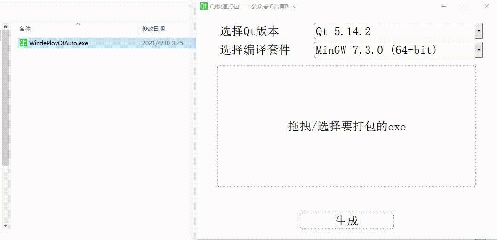
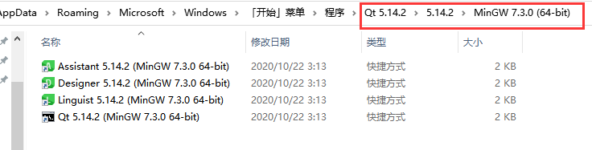

# Qt程序快捷打包工具
### 开发环境

+ 本程序使用Qt5.14.2 开发
+ 纯代码，无UI界面文件

### 效果展示

由于使用传统的打包方式有些微的复杂，所以做了一个基于Windows系统的快速打包工具。



### 使用方法

+ 把需要打包的程序拖拽到窗口中，或者点击在文件中选择程序
+ 如果上面默认的Qt版本和编译套件，不符合你的程序要求，可以下拉选择
+ 然后点击生成，如果程序文件中出现了许多依赖项，则表示打包成功
+ 然后进行测试(该打包程序比较简单，没有进行错误提示....注意路径和文件的正确性)


## 代码简单分析

### 1，获取开始菜单目录

> findqtpath.h	->	QString getStartMenuPath()

Qt安装之后会在开始菜单创建图标，所以可以在**开始菜单** / **程序**下面找到Qt所有版本

```powershell
%homePath%\AppData\Roaming\Microsoft\Windows\Start Menu\Programs
```

homePath可以通过QDir::homePath()获得，下面是完整路径

```cpp
C:\Users\Maye\AppData\Roaming\Microsoft\Windows\Start Menu\Programs
```


### 2，获取本机所有Qt版本

> findqtpath.h	-> QStringList getQtAllVer()

在上面的目录下找到所有Qt开头的目录，即版本，并保存下来


### 3，根据Qt版本获取所有编译套件

> findqtpath.h	->	QStringList getQtCompileKits(const QString& qtVer)

进入Qt 5.14.2\5.14.2目录，即可看到所有的编译套件，把该目录下面的所有目录都保存下来


### 4，把版本和编译套件显示到窗口上

> guiwidget.cpp	->	    void cBox_versionAddItems();
>     									 void cBox_kitsAddItems(const QString& qtVer);

+ 先设置Qt的版本
+ 然后获取当前下拉框中默认的版本，传入cBox_kitsAddItems函数设置对应Qt版本的所有编译套件


### 5，获取windeployqt路径

> findqtpath.h	->	QString getWindePloyQtPath(const QString& qtVer,const QString& compilerKit)

根据指定的Qt版本和Qt编译套件，获取WindePloyQt.exe的全路径

+ 首先，进入编译套件的目录，该目录下全部都是快捷方式



+ 然后，找一个指向WindePloyQt所在目录的快捷方式，刚好前三个都满足要求，所以随便来一个即可。用QDir QFileInfo::symLinkTarget()获取路径。


### 6，打包

> findqtpath.h	->	 bool ApplicationPackage(const QString& windeployqt,const QString& exeFile)

ApplicationPackage根据传进来的windeployqt.exe句对路径和待打包的绝对路径进行打包。

